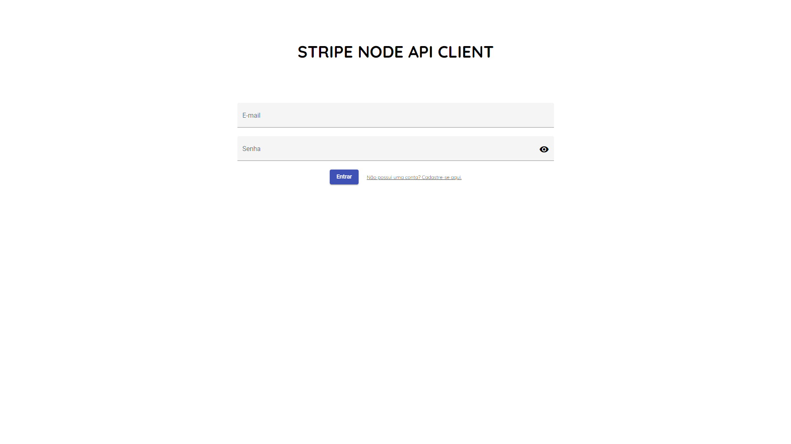
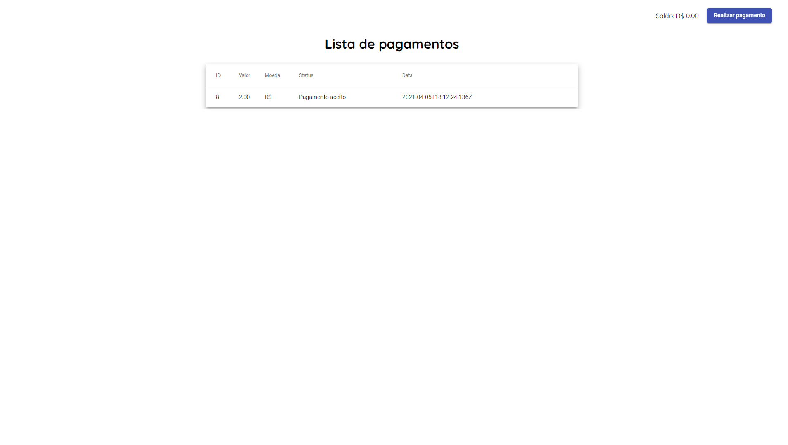

# Application for testing stripe API using Angular in frontend and Nodejs in backend
***
#### *About Stripe*
 > Stripe is a technology company that builds economic infrastructure for the internet. Businesses of every size—from new startups to public companies—use our software to accept payments and manage their businesses online. Learn more in their website:
 
  
#### *About Application*
> This application was built for learning purpouses. The idea about it is just understand the conecpts of Stripe API and the integration of it with another REST API. This application was build with Nodejs in the backend, using express for routing system, sequelize and sqlite3 for storage of data and jwt for autenthication. The frontend was built with Angular 10 and used material design with angular material.
  
# Installing and running application
***
 - #### Angular-CLI
   To run an Angular application, you need to had the Angular-CLI installed on your machine. With the following command you can install angular-cli on your machine:

        npm install -g @angular/cli 
        or
        yarn global add @angular/cli
 - #### Download repository
   You need to download/clone the repository on your machine. You can use the following git command for it:

        git clone https://github.com/IanKarlo/Angular-Stripe.git
 - #### Install front-end dependencies
   To install front-end dependencies, go to repository directory in your machine and you can use the following command:

        npm install
        or
        yarn add
 - #### Install back-end dependencies
   To install back-end dependencies, insite the repository directory in your machine use the followings commands:

        cd backend
        npm install
        or
        yarn install
 - #### Run front-end
   First of all you need to configure your enviroment variables. Go to enviroment.ts file inside enviroments folder inside src folder and put the correct values for it (your stripe publish key is provided in your stripe account).Then to run frontend, in the repository directory root run the command:

        ng serve
 - #### Run back-end
   First of all you need to configure the .env file, change the name of .env.example file to .env and fill the enviromental variables with correct values (your stripe secret is provided in your stripe account). Then to run backend, in the repository directory root run the following commands:

        cd backend
        npm start
        or
        yarn start

# Application screens and operation
***
## How it works
The application is a simple recharge system, that allow users recharge their balance by "paying" any amount (limited by Stripe max) in three diferents currencies, and recharge in BRL (R$). The system was build to brazilian users, so you can just change de basis of recharge in backend and change all the portuguese tests to your language of preference.
### Login
> 
The application had a login screen and register screen, that is used to bind all the payments to the correct users in the system. The JWT authentication ensures that only system users can make the requests.
  
### Home
> 
In the home page, the user can see all the payments intents and their current status and their current balance. The update of status is based in Stripe webhooks, that is sent to and specific route of the application API (from Stripe API). You can learn more about Stripe webhooks in their [documentation](https://stripe.com/docs).

### Payment
> 
In the payment page, the user can select the amount of charge in their account (the basis recharg is in BRL currency) and the currency, and put the card data, all of this uses the Stripe test API. You can see all the card numbers in Stripe [documentation](https://stripe.com/docs).
